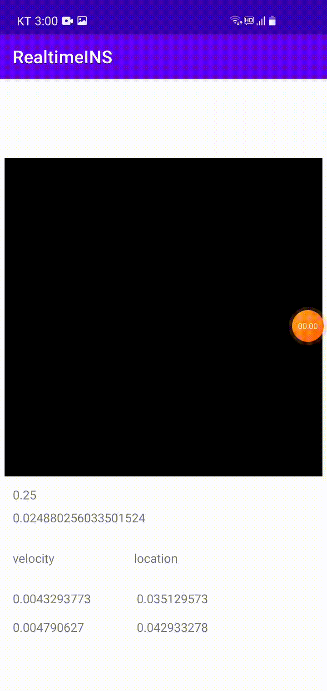

# Real-time-INS-Android

RoNIN ResNet-18 모델을 이용한 실시간 관성항법시스템입니다. 학습에 관련된 코드는 [이곳](https://github.com/chanyeong97)에서 확인하실 수 있습니다.
RoNIN에 대한 자세한 설명은 [이곳](https://github.com/Sachini/ronin)에서 확인하실 수 있습니다.

## 개요

- 

## 개발환경

- Android Studio @31.1.4
- Android 7.0(API 수준 24)
